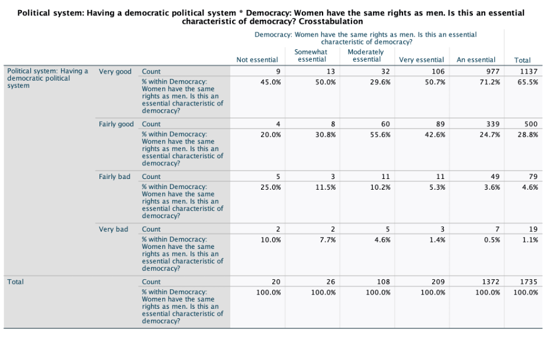

# Bivariate Analysis

Crosstabulation was produced because the independent variable is ordinal and the dependent variable is ordinal, 
thus best fit for bivariate analysis is crosstabulation. Recoding of womenrights was undertaken for bivariate analysis to give a more concise view of the answers,
however not distilling it into too few categories which would lose nuance. 

### Table 7

### Table 8
Chi-Square tests for womenrightsRecode and democracy

| Value                        | df  | Asymptotic Significance (2-sided) |
|------------------------------|-----|----------------------------------|
| Pearson Chi-Square           | 159.835a | <.001                        |
| Likelihood Ratio             | 127.161 | <.001                        |
| Linear-by-Linear Association | 114.526 | <.001                        |
| N of Valid Cases             | 1735   |                                  |

a. 7 cells (35.0%) have expected count less than 5. The minimum expected count is .22.

### Table 9
Symmetric Measures for womenrightsRecode and democracy

|Level of Measurement  | Symmetric Measures | Value                      | Asymptotic Standard Error(a) | Approximate T(b) | Approximate Significance |
|--|-----|----------------------------|----------------------------|-----------------|--------------------------|
| Nominal by Nominal  | Phi          | 0.304            |       -          |-| <.001                    |
| Nominal by Nominal  | Cramer's V                 | 0.175                      |     -          | - | <.001          | 
| Interval by Interval| Pearson's R                | -0.257                     | 0.031           | -11.070                  | <.001c    |
|Ordinal by Ordinal| Spearman Correlation       | -0.246                     | 0.025           | -10.583                  | <.001c      |
| N of Valid Cases           | -                      |    1735             |           -               | - | -

a. Not assuming the null hypothesis.
b. Using the asymptotic standard error assuming the null hypothesis.
c. Based on normal approximation.

### Description of findings

A crosstabulation of womenrightsRecode and democracy was produced. Table 7.1 shows the existence of a relationship. We can see that since there is a change in the percentages that a relationship exists. If democracy was unrelated to womenrightsRecode, then we would expect to find equal percentages for among both those who believe they live in a very good democracy and those who live in a perceived very bad democracy. 

### Interpretion of the direction, strength, and statistical significance of the relationship
The direction/pattern of the relationship is shown in Table 7.1. Overall, the crosstabulation shows a positive correlation, as democracy (X) goes up, womenrightsRecode (Y) goes up. We see a difference of ‘fairly good’ (n=5) democracy say 5% more that women rights are ‘not essential’ than people who respond, ‘fairly good’ (n=4). This can be due to the small number of respondents for this category, meaning the confidence interval would be larger. To conclude, the pattern of the relationship shows people perceived living in better democracies, people tend to believe women rights more essential than those who live in worse democracies. 

### Conclusion
Table 7.3 presents the Cramer’s V which shows the strength of association in the relationship The strength of the relationship is moderate (Cramer’s V = 0.175). This indicates usefulness in predicting the dependent variable from the independent variable. 
A Chi-Square Test was preformed to find if the relationship is significant. Shown in Table 7.2, the p-value<0.001, this means that the relationship is highly statistically significant. We are 99% confident that the relationship observed in the sample holds in the population. We reject the null hypothesis that there is no relationship between the quality of democratic political system and if women’s rights are perceived as essential. We are 99% confident that, in Great Britain, people who believe that they live in a very good democracy also believe that women rights are essential characteristic for a democracy.   

### Sociological Framework
Modernization theory could be used to sociologically interpret these results. In theory, as societies become more modern, they also become more democratic and egalitarian. In this context, as people perceive their society to be a good democracy, they may also perceive women’s rights as essential. Women rights and democracy are tied together in the name of ‘progress’ and becoming more ‘modern’. People who believe in women rights as an essential factor of democracy are more likely to perceive themselves living in a good democracy or vice versa. 

However, modernization is a problematic concept, as it may only apply the West and Great Britain, it has come under scrutiny by many scholars (for example, Bruno Latour “Why we will never be modern”).

Another possible theoretical framework that can be used to interpret the data is through the lens of feminist theory. A feminist researcher would suggest that analysis of the structured interview questions is not sufficient to sustain the study’s findings. Qualitative interviews of the group of people who perceive they live in a lesser democracy could be fundamental to gaining deeper understanding of their point of view. In this case, the study could lead to social change and increasing social policy which improves women rights further. Additionally, leaving the question for the quality of democracy open-ended would help us to understand what makes a ‘very good’ or ‘very bad’ democracy. Does the quality of Great Britain’s democracy rely on the comparison of other counties or compared to the UK at a different point in time?

### Introducing a third variable to the analysis
I would introduce the level of education as a control variable. It may impact a person’s understanding and perception of democracy and women’s rights. Higher education levels might be associated with a greater understanding and support for democratic principles and women’s rights.
