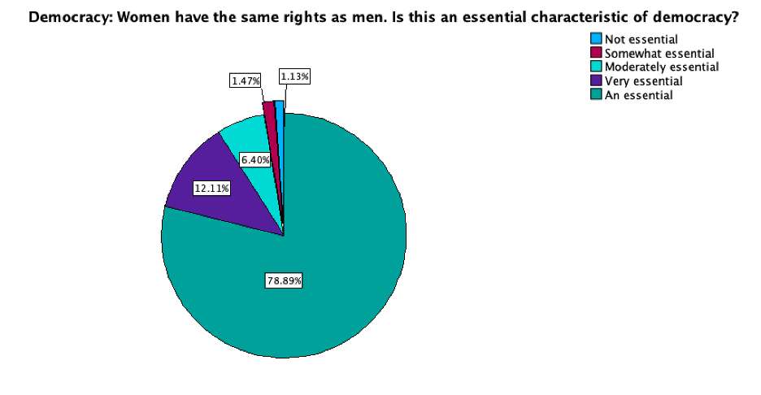
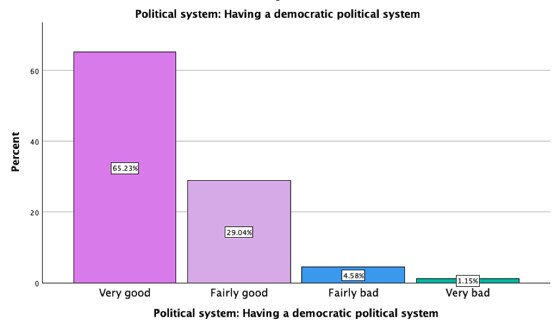

# EVS2018-GB_SPSS

## Introduction
Using the European Values Study for Great Britain (ESV, 2018) in SPSS to answer the Research Question: Is there a relationship between perceived quality of democratic political system and perceived women rights compared to men.

## Index
- [Introduction](#introduction)
- [Research Question](#research-question)
- [Rationale](#rationale)
- [Hypothesis](#hypothesis)
- [Data Description](#data-description)
  - [Dataset]
  - [Variable description](#variable-description)
- [Analysis]
  - [Univarite Analysis](#Univarite-Analysis)
  - [Bivariate Analysis]
- [Ethical Approval](#ethical-approval)
- [References](#references)
- [Copyright](#copyright)

  
## Reseach Question

**Research Question**: Is there a relationship between perceived quality of democratic political system and perceived women rights compared to men.

## Rationale

Why is this question sociologically relevant and interesting? 

This question will answer if the quality of the democratic political system influences equal rights between men and women. This is sociologically interesting because it answers two fundamental aspects of society, gender, and politics. It seeks to understand whether democracy benefits gender equality. Sociology of gender and Political Sociology are interesting and relevant fields.

The level of gender equality could be seen as a measure of a democracy’s quality. Democracies that uphold equal rights for all citizens, regardless of gender, may be considered ‘better’ or effective.

It must be kept in mind that the data is not inclusive of all gender identity, and this could be explored in further collection of data (i.e. does perceived quality of democratic political system influence if trans/non-binary people have the same (perceived) rights as men and women.). This research question can strengthen our understanding of political systems as a social institution with large capabilities for social change.

## Hypothesis 
Both variables are *ordinal* therefore a *crosstabulation* will be conducted. It could go both ways, democracy could influence womenrights;womenrights could influence democracy.

>**Independent variable:** democracy 
>**Dependent variable:** womenrightsRecode

**Null Hypothesis H0:** There is no significant relationship between perceived quality of democratic political system and perceived women rights compared to men.
**Alternative Hypothesis H1:** There is a significantrelationshipbetweenperceivedqualityofdemocratic political system and perceived women rights compared to men.

## Data Description
I am using EVS2018-GB.sav (EVS, 2020), the unit of analysis is ‘individuals’ in Great Britain. The sample size of the data set is 1788.
There are 181 variables (including 4 variables which have been recoded for this exercise and others) 

## Variable description 

Variable Name: democracy (variable 122),
Variable label: Political system: Having a democratic political system Level of Measurement: Ordinal
Value Label: (negative values are not used in the analysis) 

### Table 1

| Value | Label         |
|-------|---------------|
| 1     | Very Good     |
| 2     | Fairly Good   |
| 3     | Fairly Bad    |
| 4     | Very Bad      |

Variable Name: womenrights (variable 130)
Variable Label: Democracy: Women have the same rights as men. Level of Measurement: Ordinal
Value Label: (negative values are not used in the analysis) Old Valyes

## Recoded Variables
Variable Name: womenrightsRecode:
Variable Label: Democracy: Women have the same rights as men. Is this a essential characteristic of democracy?
Level of Measurement: Ordinal Value Label:

I did not recode democracy due to the variables already capturing the essential data points necessary to conduct a bivariate analysis.
I have recoded the variable womenrights into womenrightsRecode. I decided to recode the 10 categories into 5 categories (Not essential, Somewhat essential,
Moderately essential, Very essential, An essential characteristic). This was done to give a more concise view of the answers, however not distilling it into too few categories which would lose nuance.

### Table 2

| Value | Label                                                         | New | Label                                      |
|-------|---------------------------------------------------------------|-----|--------------------------------------------|
| 0     | (It is against democracy 1 (spontaneous))                     | 1   | Not essential                              |
| 1     | (Not an essential characteristic of democracy)                | 1   | Not essential                              |
| 2     | 2                                                              | 2   | Somewhat essential                        |
| 3     |  3                                                             | 2   | Somewhat essential                        |
| 4     |  4                                                             | 2   | Moderately essential                       |
| 5     |  5                                                             | 3   | Moderately essential                       |
| 6     |  6                                                             | 3   | Moderately essential                       |
| 7     |  7                                                             | 4   | Very essential                             |
| 8     |  8                                                             | 4   | Very essential                             |
| 9     |   9                                                            | 5   | An essential characteristic               |
| 10    | (An essential characteristic of democracy)                    | 5   | An essential characteristic of democracy   |

# Analysis

## Univarite Analysis

### Table 3
*Descriptive statistics for if women have the same rights as men (recode).*

| Statistic  | Value  |
|------------|--------|
| N (Valid)  | 1767   |
| N (Missing)| 21     |
| Median     | 5.0000 |
| Mode       | 5.00   |
| Range      | 4.00   |

### Table 4
*Frequency table for if women have the same rights as men (recode).*

| | Category               | Frequency | Percent | Valid Percent | Cumulative Percent |
|--||------------------------|-----------|---------|---------------|--------------------|
| Valid  |                   |           |         |               |                    |
| |Not essential          | 20        | 1.1     | 1.1           | 1.1                |
| |Somewhat essential     | 26        | 1.5     | 1.5           | 2.6                |
| |Moderately essential   | 113       | 6.3     | 6.4           | 9.0                |
| |Very essential         | 214       | 12.0    | 12.1          | 21.1               |
| |An essential           | 1394      | 78.0    | 78.9          | 100.0              |
| |Total                  | 1767      | 98.8    | 100.0         |                    |
| Missing  |              |           |         |               |                    |
| |System                 | 21        | 1.2     |               |                    |
| |Total                  | 1788      | 100.0   |               |                    |

### Figure 1
*Graphical representation for if womenrightsRecode.*

### Descriptive narrative for womenrightsRecode
A table for descriptive statistics for womenrightsRecode was produced, shown in Table 6.1. The descriptive statistics calculate the measures of central tendency for the ordinal variable. It shows that the Median of people think women rights are ‘an essential’ characteristic of democracy. The Mode for women rights is ‘an essential’ characteristic of democracy (Value Label = 5) was most answered by respondents. These results can be found in Table 6.1.
The measure of dispersion was produced in Table 6.1 and Table 6.2. The range is 4, shown in Table 6.1. A frequency table produced in Table 6.2 shows that 1.1% (n=20) responded not an essential characteristic of democracy, 1.5% (n=26) said ‘somewhat’, 6.4% (n=113) answered ‘moderately essential and 12.1% (n=214) ‘very essential’. The majority of respondents, 78% (n=1394) believed that women having the same rights as men is an essential characteristic of democracy. 
The graphical representation for womenrightsRecode in Figure 6.1 was presented in a Pie Chart with percentages. 

### Table 6
*Descriptive statistics for Political system: Having a democratic political system.*

| Statistic  | Value  |
|------------|--------|
| N (Valid)  | 1746   |
| N (Missing)| 42     |
| Median     | 1.00   |
| Mode       | 1      |
| Range      | 3      |

### Table 7
*Frequency Table for Political system: Having a democratic political system.*

| Category       | Frequency | Percent | Valid Percent | Cumulative Percent |
|----------------|-----------|---------|---------------|--------------------|
| Valid          |           |         |               |                    |
| Very good      | 1139      | 63.7    | 65.2          | 65.2               |
| Fairly good    | 507       | 28.4    | 29.0          | 94.3               |
| Fairly bad     | 80        | 4.5     | 4.6           | 98.9               |
| Very bad       | 20        | 1.1     | 1.1           | 100.0              |
| Total          | 1746      | 97.7    | 100.0         |                    |
| Missing        |           |         |               |                    |
| No answer      | 1         | 0.1     |               |                    |
| Don’t know     | 41        | 2.3     |               |                    |
| Total          | 42        | 2.3     |               |                    |
| Total          | 1788      | 100.0   |               |                    |

### Figure 2
*Graphical representation for if Democracy*

### Descriptive narrative for democracy

A table for descriptive statistics for democracy was produced, shown in Table 6.3. The descriptive statistics calculate the measures of central tendency for the ordinal variable. The Median of people think they have a ‘very good’ democratic political system (Value label=1). The Mode of people believe that they live in a ‘very good’ democratic political system (Value label=1). 
The measure of dispersion was produced in Table 6.3 and Table 6.4. The range is 4, shown in Table 6.3. A frequency table was produced, Table 6.4, shows that most respondents 65.2% (n=1134) answered a ‘very good’, followed by 29% (n=507) who said, ‘fairly good”. Only 4.6% (n=80) and 1.1% (n=20) said ‘fairly bad’ and ‘very bad’ respectively.
The graphical representation for democracy in Figure 6.2 was presented in a Bar Chart with percentages. 

## Bivarite Analysis

## Ethical Approval 

## References
EVS (2020). European Values Study Longitudinal Data File 1981-2008 (EVS 1981-2008). GESIS Data Archive, Cologne. ZA4804 Data file Version 3.1.0, [https://doi.org/10.4232/1.13486](https://doi.org/10.4232/1.13486).

## Copyright 
[european-values-survey-SPSS](https://github.com/ctmazilu/european-values-survey-SPSS.git) © 2024 by [Christina Mazilu](https://github.com/ctmazilu) is licensed under [Creative Commons Attribution-NonCommercial-ShareAlike 4.0 International](https://creativecommons.org/licenses/by-nc-sa/4.0/) 
